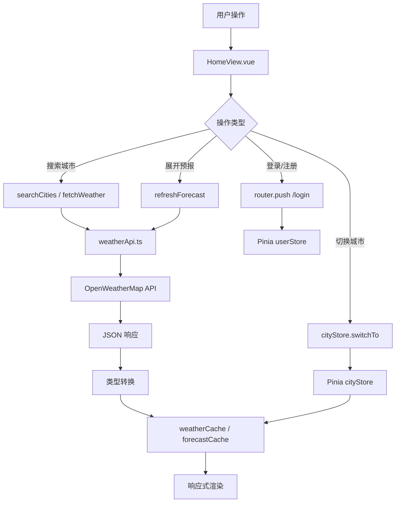

# WeWeather -- 智能天气查询系统

> Vue 3 + TypeScript + Pinia 前端课程大作业

---

## 项目概述

WeWeather 是一款基于 Vue 3 生态构建的现代化天气查询 Web 应用，集成 **OpenWeatherMap API** 实时获取全球城市天气数据，支持多城市管理、用户认证、动态主题切换与七日预报展示。

---

## 核心功能

| 模块 | 功能说明 |
|------|----------|
| 城市搜索 | 模糊搜索 + 下拉建议，支持中英文城市名映射 |
| 多城市管理 | 添加 / 删除 / 切换城市，滑动切换，设为默认城市 |
| 实时天气 | 温度、体感温度、湿度、风速、日出日落、天气图标 |
| 空气质量 | AQI 指数、PM2.5、PM10、O3 实时数据 |
| 预报图表 | SVG 折线图展示 12 小时逐时温度 + 七日预报温度条 |
| 小组件展开 | 湿度/风速、日出日落、空气质量、体感温度四项组件支持展开详情 |
| 用户系统 | 注册 / 登录 / 退出，数据按用户隔离（localStorage 持久化） |
| 动态主题 | 日间 / 黄昏 / 夜间三种背景自动或手动切换，含星空动画 |
| 主题过渡 | 背景双层淡入淡出 + 文字/卡片颜色平滑过渡动画 |
| 路由导航 | vue-router 实现登录页 / 主页路由跳转，导航守卫拦截未登录 |

---

## 技术栈

| 类别 | 技术 | 用途 |
|------|------|------|
| 框架 | **Vue 3** (Composition API) | 组件化 UI 构建 |
| 语言 | **TypeScript** | 类型安全，接口约束 |
| 构建 | **Vite** | 开发服务器 + 生产打包 |
| 状态管理 | **Pinia** | 用户 Store + 城市 Store |
| 路由 | **Vue Router** | 登录/主页路由 + 导航守卫 |
| 数据持久化 | **localStorage** | 用户信息 + 城市列表 |
| API | **OpenWeatherMap** | Current Weather / Forecast / Air Pollution |
| 样式 | **Scoped CSS + CSS Transition** | 主题过渡、组件动画 |

---

## 项目结构

```
WeWeather/
├── index.html                    # 入口 HTML
├── vite.config.ts                # Vite 配置（别名、插件）
├── package.json                  # 依赖与脚本
├── tsconfig.json                 # TypeScript 配置
├── .env                          # 环境变量（API Key）
│
└── src/
    ├── main.ts                   # 应用入口（挂载 Pinia + Router）
    ├── App.vue                   # 根组件（<router-view /> 外壳）
    │
    ├── router/
    │   └── index.ts              # 路由配置 + beforeEach 守卫
    │
    ├── views/
    │   ├── HomeView.vue          # 天气主页（全部业务逻辑）
    │   └── LoginView.vue         # 登录/注册页
    │
    ├── components/
    │   ├── WeatherDisplay.vue    # 天气主显示（城市名、温度、图标）
    │   ├── WidgetHumidityWind.vue # 湿度/风速小组件
    │   ├── WidgetSunriseSunset.vue# 日出/日落小组件
    │   ├── WidgetAirQuality.vue  # 空气质量小组件
    │   ├── WidgetFeelsLike.vue   # 体感温度小组件
    │   └── AuthModal.vue         # （已废弃，保留备用）
    │
    ├── stores/
    │   ├── user.ts               # 用户状态管理（localStorage 持久化）
    │   └── cityStore.ts          # 城市列表管理
    │
    ├── services/
    │   └── weatherApi.ts         # OWM API 封装（实时/预报/空气质量）
    │
    ├── types/
    │   └── weather.ts            # TypeScript 接口定义
    │
    └── data/
        └── cities.ts             # 城市中英文映射表 + 搜索函数
```

---

## 快速开始

### 安装依赖

```bash
npm install
```

### 配置 API Key

在项目根目录创建 `.env` 文件：

```env
VITE_OWM_API_KEY=你的OpenWeatherMap_API_Key
```

> 免费 Key 可在 [openweathermap.org](https://openweathermap.org/api) 注册获取

### 开发模式

```bash
npm run dev
```

访问 `http://localhost:5173`

### 生产构建

```bash
npm run build-only
npm run preview
```

---

## 用户系统设计

- **注册**：用户名 + 密码存入 `localStorage`，用户名唯一校验
- **登录**：校验本地存储的用户数据（纯前端模拟）
- **数据隔离**：不同用户拥有独立的城市列表
- **路由守卫**：`router.beforeEach` 拦截未登录请求，重定向至 `/login`

---

## 主题系统设计

| 模式 | 触发条件 | 背景渐变 |
|------|----------|----------|
| 日间 | 6:00-17:00（自动） | `#e8f2fb -> #c5ddf5` 淡蓝 |
| 黄昏 | 17:00-19:00（自动） | `#f9d56e -> #fffef9` 暖黄 |
| 夜间 | 19:00-6:00（自动） | `#2d3a5c -> #0a0f1f` 深蓝 + 星空 |

- 点击衣物按钮可手动切换 `自动 -> 日间 -> 黄昏 -> 夜间 -> 自动`
- 背景渐变无法直接 transition，采用 **双层背景 + opacity 淡入淡出** 方案实现平滑过渡
- 所有文字、卡片、按钮均添加 `transition: color/background 0.8s` 实现整体协调过渡

---

## 数据流架构



---

## 设计亮点

1. **缓存策略**：天气数据与预报数据按城市名缓存，切换已访问城市时秒级响应
2. **API 降级**：网络异常时自动回退 Mock 数据，保证演示不中断
3. **背景过渡**：CSS gradient 不可补间，通过双层 fixed 背景 + opacity 动画巧妙实现
4. **Scoped 穿透**：使用 `:deep()` 解决父组件夜间模式样式无法覆盖子组件的问题
5. **代码分割**：Vue Router 懒加载 `() => import(...)`，首屏加载体积最优

---

## 答辩要点

| 环节 | 演示建议 |
|------|----------|
| 功能介绍 | 搜索城市 -> 查看天气 -> 展开预报 -> 切换小组件 |
| 用户系统 | 演示注册 -> 登录 -> 添加专属城市 -> 退出 |
| 主题切换 | 点击衣物按钮依次展示日/夜/黄昏 + 过渡动画 |
| 技术亮点 | 讲解 Pinia 状态管理、路由守卫、缓存策略、`:deep()` 穿透 |
| 亮点展示 | 搜索建议下拉（夜间适配）、星空动画、SVG 温度折线图 |

---

## 开源协议

MIT License -- 仅供学习交流使用