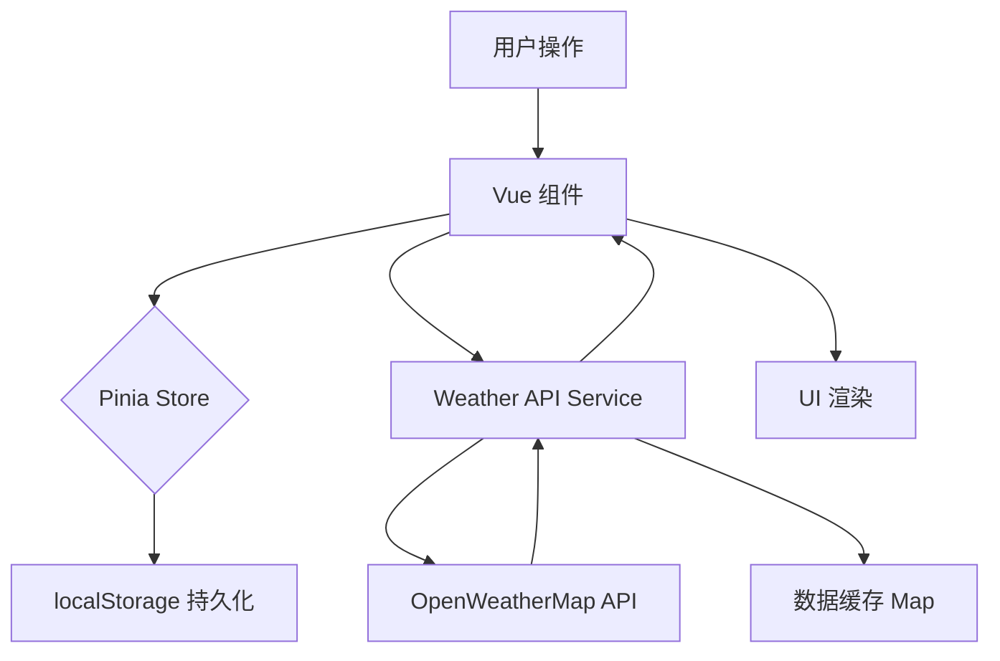

# WeWeather 智能天气查询系统 — 需求文档

> 版本：v1.0  
> 日期：2026-07-12  
> 技术栈：Vue 3 + TypeScript + Pinia + Vue Router + Vite

---

## 1. 项目背景

WeWeather 是一款基于 Vue 3 生态构建的现代化天气查询 Web 应用（SPA），集成 **OpenWeatherMap API** 实时获取全球城市天气数据，面向普通用户提供简洁、美观的多城市天气查询与管理体验。本项目同时也是 Vue 3 前端课程的综合性大作业。

---

## 2. 用户角色

| 角色 | 描述 |
|------|------|
| 游客 | 未登录用户，仅能访问登录/注册页面 |
| 注册用户 | 登录后可访问主页，管理城市列表、查看天气数据 |

---

## 3. 功能需求

### 3.1 用户认证模块

| 编号 | 功能 | 描述 | 优先级 |
|------|------|------|--------|
| U-01 | 用户注册 | 输入用户名 + 密码（≥4位）+ 确认密码，注册后自动登录 | P0 |
| U-02 | 用户登录 | 输入已注册的用户名和密码进行登录，校验失败给出明确提示 | P0 |
| U-03 | 用户退出 | 点击退出按钮清除登录状态，返回登录页 | P0 |
| U-04 | 路由导航守卫 | 未登录用户访问主页自动跳转至登录页；已登录用户访问登录页自动跳转主页 | P0 |
| U-05 | 数据隔离 | 不同用户的城市列表、默认城市等数据按用户名隔离存储在 localStorage | P0 |

#### 认证规则
- 用户名和密码不可为空
- 密码长度至少 4 位
- 注册时需两次输入密码一致
- 用户凭据存储在 `localStorage`（`weweather_users` 键）
- 当前登录用户存储在 `localStorage`（`weweather_user` 键）

---

### 3.2 城市管理模块

| 编号 | 功能 | 描述 | 优先级 |
|------|------|------|--------|
| C-01 | 城市搜索 | 搜索框输入关键字，模糊匹配城市中文名和英文名，下拉显示最多 8 条建议 | P0 |
| C-02 | 添加城市 | 从搜索建议中点击城市将其加入城市列表，自动切换到该城市 | P0 |
| C-03 | 切换城市 | 点击城市列表中的城市进行切换，也支持左右滑动切换 | P0 |
| C-04 | 删除城市 | 城市列表中点击删除按钮移除城市（至少保留 1 个城市） | P1 |
| C-05 | 设为默认城市 | 将指定城市移至列表首位，作为默认城市 | P1 |
| C-06 | 重置城市列表 | 一键重置为默认城市（昆明） | P2 |
| C-07 | 城市数据持久化 | 城市列表和当前选中城市索引持久化到 localStorage，按用户隔离 | P0 |

#### 预置城市库
支持 **36 个中国主要城市**（北京、上海、广州、深圳、成都、杭州、重庆等）和 **10 个国际主要城市**（东京、首尔、纽约、伦敦、巴黎等），使用中英文映射解决 OpenWeatherMap 不支持中文搜索的问题。

---

### 3.3 实时天气展示模块

| 编号 | 功能 | 描述 | 优先级 |
|------|------|------|--------|
| W-01 | 天气概览 | 展示城市名称、天气描述、天气图标、当前温度（大字号） | P0 |
| W-02 | 温度单位 | 使用摄氏温度（°C） | P0 |
| W-03 | 体感温度概览 | 在主界面简要展示体感温度 | P0 |
| W-04 | API 失败回退 | API 不可用时自动使用本地 Mock 数据展示，保证界面可用 | P0 |

#### 天气数据字段
| 字段 | 说明 | 来源 |
|------|------|------|
| 城市名称 | 中文名 | 本地映射 |
| 当前温度 | 整数，°C | OWM Current Weather |
| 体感温度 | 整数，°C | OWM Current Weather |
| 湿度 | 百分比 | OWM Current Weather |
| 风速 | m/s | OWM Current Weather |
| 天气描述 | 中文 | OWM Current Weather（lang=zh_cn） |
| 天气图标 | OWM 图标代码 | OWM Current Weather |
| 日出时间 | HH:mm | OWM Current Weather |
| 日落时间 | HH:mm | OWM Current Weather |

---

### 3.4 小组件（Widget）模块

页面底部提供 4 个小组件，每个组件有**紧凑模式**和**展开详情模式**两种状态：

#### 3.4.1 体感温度组件（WidgetFeelsLike）

| 编号 | 功能 | 描述 | 优先级 |
|------|------|------|--------|
| FW-01 | 体感温度数值 | 大字展示体感温度数值 + °C | P0 |
| FW-02 | 体感描述 | 根据体感-实际温差显示：体感较热/略暖/适中/略凉/较凉 | P0 |
| FW-03 | 展开详情 | 显示实际温度、体感温度、差值对比 | P1 |
| FW-04 | 舒适度进度条 | 0~40°C 范围内的舒适度可视化条形图 | P1 |

#### 3.4.2 空气质量组件（WidgetAirQuality）

| 编号 | 功能 | 描述 | 优先级 |
|------|------|------|--------|
| AQ-01 | AQI 等级徽章 | 彩色徽章展示空气质量等级（优/良/轻度/中度/重度污染） | P0 |
| AQ-02 | 污染物详情 | PM2.5、PM10、O₃ 数值展示（μg/m³） | P0 |
| AQ-03 | AQI 颜色映射 | 按 AQI 区间自动着色（绿→黄→橙→红→紫→棕） | P0 |
| AQ-04 | 展开详情 | 显示 AQI 量规表（优→重度）和出行建议 | P1 |

#### 3.4.3 湿度/风速组件（WidgetHumidityWind）

| 编号 | 功能 | 描述 | 优先级 |
|------|------|------|--------|
| HW-01 | 湿度数值 | 百分比数值展示 | P0 |
| HW-02 | 风速数值 | m/s 数值展示 | P0 |
| HW-03 | 展开详情 | 湿度进度条 + 湿度等级标签（干燥/舒适/微潮/潮湿） | P1 |
| HW-04 | 展开详情 | 风速等级标签（无风/微风/和风/强风/大风） | P1 |

#### 3.4.4 日出日落组件（WidgetSunriseSunset）

| 编号 | 功能 | 描述 | 优先级 |
|------|------|------|--------|
| SS-01 | 日出/日落时间 | 展示具体的日出、日落时间 | P0 |
| SS-02 | 昼长计算 | 根据日出日落自动计算昼长（如 "13h 37m"） | P0 |
| SS-03 | 白天进度 | 实时展示当前时间在日出-日落区间的进度百分比 | P1 |
| SS-04 | 进度标签 | 日出前/日落后/白天已过 X% | P1 |

---

### 3.5 预报模块

| 编号 | 功能 | 描述 | 优先级 |
|------|------|------|--------|
| F-01 | 逐小时预报 | SVG 折线图展示未来 24 小时（3h 间隔 × 8 个点）温度变化趋势 | P0 |
| F-02 | 每小时详情 | 折线图下方展示每个时间点的图标 + 温度 | P0 |
| F-03 | 七日预报 | 展示未来 7 天每日天气：星期、图标、天气描述、最高/最低温度条 | P0 |
| F-04 | 预报面板 | 右侧滑出面板展示预报，支持关闭按钮 | P0 |
| F-05 | 预报缓存 | 已获取的预报数据缓存在内存中，切换城市时优先使用缓存 | P1 |
| F-06 | 加载状态 | 预报数据加载时显示 loading 动画 | P0 |

#### 折线图技术规格
- 使用 SVG `<path>` 和 `<circle>` 元素自绘制
- Y 轴自适应温度范围（min-2 到 max+2）
- 渐变填充区域（蓝色半透明）
- 数据点用白色圆点标记

---

### 3.6 动态主题模块

| 编号 | 功能 | 描述 | 优先级 |
|------|------|------|--------|
| T-01 | 自动模式 | 根据当前时间自动切换日间（6:00-17:00）/ 黄昏（17:00-19:00）/ 夜间（19:00-6:00）背景 | P0 |
| T-02 | 手动切换 | 用户可点击按钮循环切换：自动 → 日间 → 黄昏 → 夜间 | P0 |
| T-03 | 背景过渡 | 双层背景叠加 + 淡入淡出实现平滑过渡动画 | P1 |
| T-04 | 文字颜色过渡 | 卡片文字和颜色随主题平滑过渡（0.8s ease） | P1 |
| T-05 | 星空动画 | 夜间模式显示 30 颗随机星星的闪烁动画 | P1 |

---

### 3.7 滑动切换城市

| 编号 | 功能 | 描述 | 优先级 |
|------|------|------|--------|
| SW-01 | 触摸滑动 | 支持触摸左右滑动切换城市（移动端） | P1 |
| SW-02 | 滑动动画 | 滑动时实时跟随手指位移，松手后判定是否切换 | P1 |

---

### 3.8 天气数据缓存

| 编号 | 功能 | 描述 | 优先级 |
|------|------|------|--------|
| DC-01 | 天气缓存 | 已获取的城市天气数据缓存在内存，避免重复请求 | P1 |
| DC-02 | 预报缓存 | 已获取的城市预报数据缓存在内存 | P1 |

---

## 4. 非功能需求

### 4.1 性能

| 编号 | 需求 | 指标 |
|------|------|------|
| NF-01 | 首屏加载 | 使用异步组件（`defineAsyncComponent`）按需加载，减少首屏体积 |
| NF-02 | 数据缓存 | 天气数据内存缓存，避免切换城市时重复 API 请求 |
| NF-03 | 星星渲染 | 星星位置预生成（`Array.from`），避免渲染时随机跳动 |

### 4.2 浏览器兼容性

| 编号 | 需求 | 指标 |
|------|------|------|
| NF-04 | 现代浏览器 | 支持 Chrome、Firefox、Safari、Edge 最新两个大版本 |

### 4.3 可维护性

| 编号 | 需求 | 指标 |
|------|------|------|
| NF-05 | TypeScript 类型安全 | 所有接口数据定义 TypeScript 类型/接口 |
| NF-06 | 组件化架构 | 功能模块拆分为独立 Vue 组件，职责单一 |
| NF-07 | Composition API | 统一使用 `<script setup>` + Composition API |

### 4.4 容错性

| 编号 | 需求 | 指标 |
|------|------|------|
| NF-08 | API 错误处理 | API 请求失败时显示错误信息，并提供 Mock 数据回退 |
| NF-09 | 空状态处理 | 无城市时显示空状态提示；无数据时显示"暂无数据" |

---

## 5. 页面路由设计

| 路径 | 页面名称 | 组件 | 权限 |
|------|----------|------|------|
| `/login` | 登录/注册页 | `LoginView.vue` | 公开 |
| `/` | 天气主页 | `HomeView.vue` | 需登录 |

**导航守卫规则：**
- 未登录 → 访问 `/` → 重定向至 `/login`
- 已登录 → 访问 `/login` → 自动跳转至 `/`

---

## 6. 组件树结构

```
App.vue
└── <router-view>
    ├── LoginView.vue
    │   └── AuthModal.vue （登录/注册弹窗）
    └── HomeView.vue
        ├── WeatherDisplay.vue （天气概览：城市名、温度、图标）
        ├── WidgetHumidityWind.vue （湿度/风速小组件）
        ├── WidgetSunriseSunset.vue （日出日落小组件）
        ├── WidgetAirQuality.vue （空气质量小组件）
        ├── WidgetFeelsLike.vue （体感温度小组件）
        ├── ForecastPanel.vue （预报右侧面板：折线图 + 七日预报）
        │   ├── HourlyChart.vue（逐小时折线图）
        │   └── DailyForecast.vue（每日预报列表）
        └── AuthModal.vue （用户菜单中的登录/注册弹窗）
```

---

## 7. 数据流设计

### 7.1 状态管理（Pinia）

| Store | 职责 | 关键状态 |
|-------|------|----------|
| `userStore` | 用户认证状态管理 | `username`, `isLoggedIn` |
| `cityStore` | 城市列表管理 | `cities[]`, `currentIndex`, `currentCity` |

### 7.2 数据流向



### 7.3 API 接口

| 接口 | 方法 | 用途 |
|------|------|------|
| `/data/2.5/weather` | GET | 获取当前天气（含温度、湿度、风速、日出日落等） |
| `/data/2.5/air_pollution` | GET | 获取空气质量（AQI、PM2.5、PM10、O₃） |
| `/data/2.5/forecast` | GET | 获取 5 天/3 小时间隔预报数据 |

参数：`q`（城市名）、`lat`/`lon`（坐标）、`appid`（API Key）、`units=metric`、`lang=zh_cn`

---

## 8. 本地存储设计

| Key | 内容 | 格式 |
|-----|------|------|
| `weweather_user` | 当前登录用户名 | `string` |
| `weweather_users` | 所有注册用户凭据 | `{ username: password }` |
| `weweather_cities_{username}` | 用户城市列表 | `{ cities: string[], current: number }` |

---

## 9. 界面布局（主页）

```
┌──────────────────────────────────────┐
│  🔍 搜索城市...          👤 用户菜单  │  顶部栏
├──────────────────────────────────────┤
│          城市名                       │
│      ☁️ 天气图标                     │  天气概览
│         32°C                         │  (WeatherDisplay)
│        多云  体感 35°C               │
├──────────────┬───────────────────────┤
│  💧 湿度/风速 │  🌅 日出/日落         │  小组件区
│   72%  3.5m/s│  05:15  18:52        │  (2×2 网格)
├──────────────┼───────────────────────┤
│  🍃 空气质量  │  🌡️ 体感温度         │
│   良  PM2.5… │  35°C  体感较热       │
├──────────────┴───────────────────────┤
│       [ 📈 查看完整预报 ▶ ]          │  预报入口
└──────────────────────────────────────┘
```

---

## 10. 未来扩展规划（V2.0 展望）

| 编号 | 功能 | 描述 |
|------|------|------|
| EX-01 | 天气预警 | 接入极端天气预警信息（台风、暴雨等） |
| EX-02 | 生活指数 | 紫外线指数、穿衣建议、运动建议等 |
| EX-03 | 地图集成 | 在地图上查看城市天气分布 |
| EX-04 | PWA 支持 | 支持离线访问和桌面安装 |
| EX-05 | 后端服务 | 将用户认证和数据迁移至后端 API，提升安全性 |
| EX-06 | 语音播报 | 支持语音播报当前天气 |
| EX-07 | 天气分享 | 支持将天气信息生成图片分享至社交媒体 |

---

## 11. 附录

### 11.1 技术栈版本

| 依赖 | 版本 |
|------|------|
| Vue | ^3.5.38 |
| TypeScript | ~6.0.0 |
| Vite | ^8.0.16 |
| Pinia | ^3.0.4 |
| Vue Router | ^5.1.0 |
| Node.js | ^22.18.0 \|\| >=24.12.0 |

### 11.2 项目脚本

| 命令 | 用途 |
|------|------|
| `npm run dev` | 启动开发服务器 |
| `npm run build` | 类型检查 + 生产构建 |
| `npm run preview` | 预览生产构建 |
